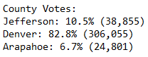
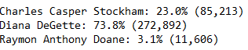
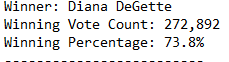

# Election_Analysis

## Overview of Election Audit
  The Election audit committee has requested that we analyze the elections results. Specifically they are looking for additional information regarding
  the voter turnout for each county, the percentage of votes from each county and the county with the highest votes.

## Election-Audit Results
  * there were 369,711 total votes.
  * The break down by County votes was: 
  
    
  
  
  * Denver had the largest voter turnout

  * Below is the breakdown by candidate of votes and thier percentage recieved.

     
     
  * The winner of the election, their vote total and percentage is below:

      
      
  * The full election summary report can be found here: [report](https://github.com/tomstowell99/Election_Analysis/blob/main/election_analysis.txt)
  

## Election-Audit Summary

The work that has been done here. Can be used to analyse other election results with minimul additional effort.
the full code can be found here [code](https://github.com/tomstowell99/Election_Analysis/blob/main/PyPoll_Challenge.py)

 * Option one: We can update the code to import a new csv file from another election.
 * 
    the current code is:
    - file_to_load = os.path.join('C:/DataBootcamp/Class Folder/Week 3 Election Analysis/Resources/election_results.csv')
    
    We would only  need to change our file_to_load variable to point to the new file. With this change we could load the new election data into our program.
    We are making the assumption that our files would have the same format and column data.
    
 * Option two: We have set this code up to evaluate the results by county. We could easily update our code to look at city elections where precincts would be a
   relevant summary function. Making the assumptions that in the csv file where county data is now located. There is now precinct data. we would:
   
    * update all references to county with precinct.
    
         3 Extract the ~county~ precinct name from each row.
         ~county_name~ precinct = row[1] 
        
         4b Add the existing ~county~ precinct to the list of counties.
            ~county~precinct_options.append(~county~ precinct_name)

         4c Begin tracking the ~county's~ precinct vote count.
         ~county~ precinct_votes[county_name] = 0

         5 Add a vote to that ~county's~ precinct vote count.
         ~county~ precinct_votes[county_name] += 1
         
        
         Partial code to show changes need for updating of print routines
         
         6 Print the ~county~ precinct results to the terminal
        ~county~_result=(
            f"{~county~ precinct}: {~county~ precinct_percent:.1f}% ({vote:,})")
        
        print(total_votes)
        print(~county~ precinct_result)
        
        
   
   
